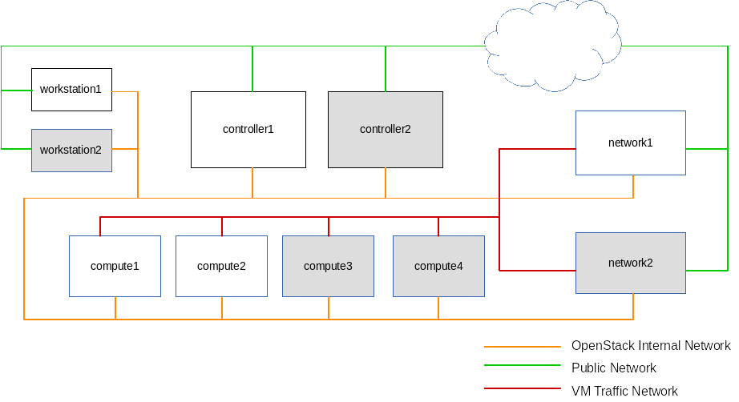

### Salt tools for OpenStack Kilo

Install OpenStack Kilo in a 3+ node architecture with neutron networking on CentOS 7.



Contents:  

- states: SaltStack state files  
- pillar: SaltStack pillar data  
- notes : Documentation and sample configuration files  

##### Prerequesites

- Salt Master is installed on the utility (workstation) node.
- Salt Minion is installed on all OpenStack nodes. 
- SELinux is disabled on all nodes.
- NTP time service is running and all times are in sync

Instruction on how to [Setup Salt Master and Minions](https://github.com/dkilcy/saltstack-base/blob/master/notes/setup-salt.md)

### Update Salt Master

1. Create /etc/salt/master.d/99-salt-envs.conf

 ```yaml
file_roots:
  base:
    - /srv/salt/base/states
  openstack:
    - /srv/salt/openstack/states
 
pillar_roots:
  base:
    - /srv/salt/base/pillar
  openstack:
    - /srv/salt/openstack/pillar
```

2. Point Salt to the git repository: `ln -sf ~/git/kilo-saltstack /srv/salt/openstack`
3. Restart the Salt Master: `systemctl restart salt-master.service`

### Update Salt Minions

From the Salt master:

1. Test connectivity to the pillars: `salt '*' test.ping`
2. Set the grains for each machine

 ```bash
salt 'controller*' grains.setvals "{'kilo-saltstack':{'role':'controller'}}"
salt 'compute*' grains.setvals "{'kilo-saltstack':{'role':'compute'}}"
salt 'network*' grains.setvals "{'kilo-saltstack':{'role':'network'}}"
```

3. Refresh and sync the minions:

 ```bash
salt '*' saltutil.refresh_pillar
salt '*' saltutil.sync_all
```

##### Related projects 
- [Salt Tools for bare-metal provisioning](https://github.com/dkilcy/saltstack-base)
